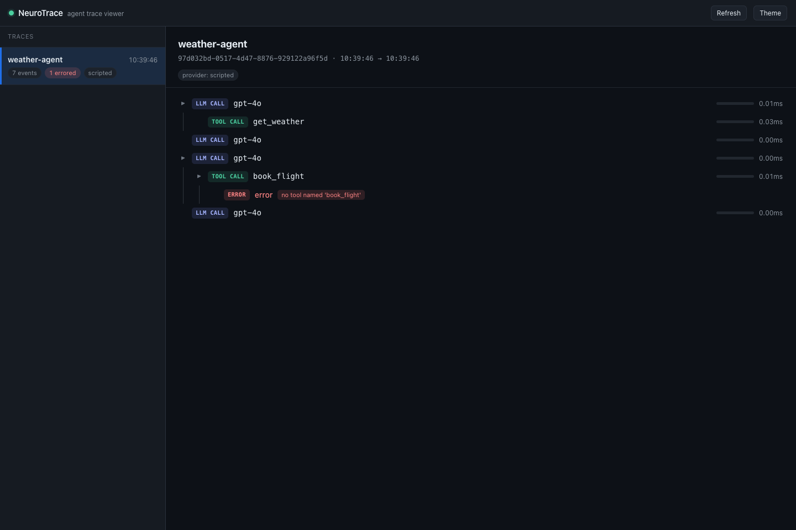
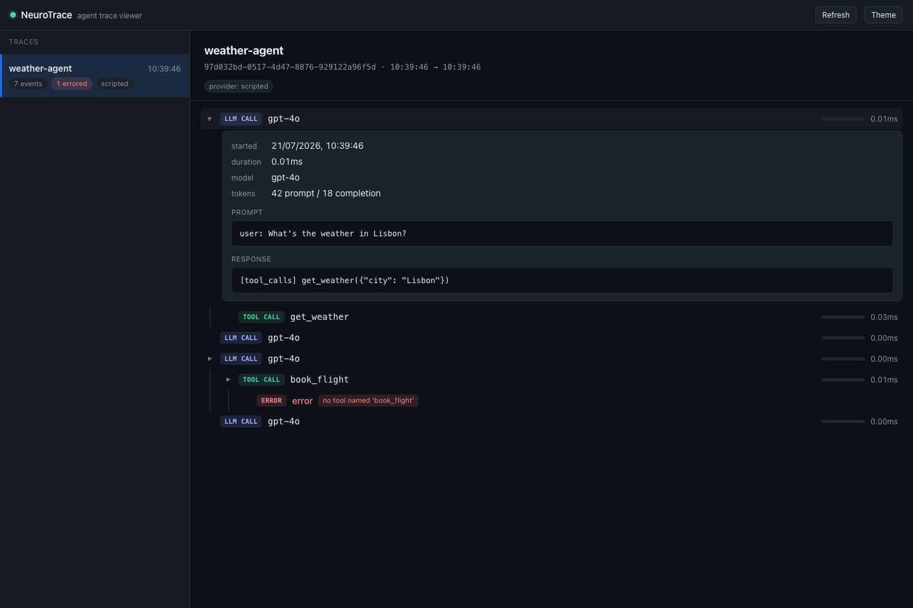

# NeuroTrace

A trace debugger/visualizer for AI agent execution. Wraps an agent's
execution loop, captures every decision (LLM call, tool call, reasoning
step, error, retry), and gives you a timeline to inspect what happened
and why. Think Chrome DevTools, but for agent runs.

## Why

Agent frameworks make it easy to build a loop and hard to see inside it.
When an agent misbehaves — infinite tool loop, hallucinated arguments,
silently swallowed error — the only recourse is usually `print()` and
re-running. NeuroTrace captures the full execution trace once, so you
can inspect it after the fact instead of re-running blind.

## Status

**v0.1.0** — the first release. Capture, storage, the OpenAI-compatible
adapter, a terminal timeline, a read-only JSON API, and a browser timeline
all work. Streaming responses are the known gap (see `CHANGELOG.md`). Design
notes as they were decided are in `docs/architecture.md`.

## Usage

Wrap your client and run your agent loop unchanged:

```python
from neurotrace import SQLiteStorage, Tracer
from neurotrace.adapters.openai import trace_openai

with Tracer(name="my-agent", storage=SQLiteStorage("traces.db")) as tracer:
    client = trace_openai(OpenAI(), tracer)

    response = client.chat.completions.create(model="gpt-4o", messages=messages)
    messages += client.dispatch_tool_calls(response, {"get_weather": get_weather})
```

Every completion becomes a traced span, and each tool the model asks for
nests under the call that requested it. Then inspect the run (timings below
are from a live run — the offline example reports ~0ms, since it never
actually calls anything):

```console
$ neurotrace view traces.db
Trace: weather-agent  (d4561a4d)  2026-07-19T18:56:11 -> 2026-07-19T18:56:11
├─ llm_call  gpt-4o  412.7ms
│  └─ tool_call  get_weather  1.2ms
├─ llm_call  gpt-4o  380.1ms
├─ llm_call  gpt-4o  291.5ms
│  └─ tool_call  book_flight  0.1ms
│     └─ error  [error: no tool named 'book_flight']
└─ llm_call  gpt-4o  244.8ms
```

`neurotrace list traces.db` shows every run in the file. For a full
working agent, see `examples/openai_agent.py` — it runs offline against a
scripted client, so no API key is needed:

```bash
python examples/openai_agent.py && neurotrace view traces.db
```

## Browser viewer

`neurotrace serve traces.db` starts a local server and prints a URL. Open it
for the timeline: a list of runs on the left, and on the right an expandable
tree where each span shows its duration as a bar and clicks open the full
prompt/response or tool arguments/result. Errors are highlighted.



```console
$ neurotrace serve traces.db
serving traces.db  (ctrl-c to stop)
  viewer:  http://127.0.0.1:8756/
  api:     http://127.0.0.1:8756/api/traces
  docs:    http://127.0.0.1:8756/docs
```

Click any span to expand it — an LLM call shows its model, token counts, and
the full prompt and response:



The page is a single self-contained HTML file with no external requests and
no build step — a trace holds your prompts and tool data verbatim, so the
viewer keeps all of it on your machine, and renders trace content as text
rather than markup. More views (the error detail and the light theme) are in
[`docs/screenshots/`](docs/screenshots/).

## HTTP API

The same server exposes the traces as read-only JSON, for tooling that wants
the data rather than the page:

| Endpoint | Returns |
|---|---|
| `GET /api/traces` | every run, with event and error counts, no payloads |
| `GET /api/traces/{id}` | one run, events flat as stored (`parent_id` links) |
| `GET /api/traces/{id}/tree` | one run, events nested the way the timeline draws them |
| `GET /api/traces/{id}/text` | the same output `neurotrace view` prints |
| `GET /docs` | generated API docs |

There are no write endpoints — traces are written by `Tracer`, in the process
being traced. The server binds to loopback by default: a trace holds prompts
and tool arguments verbatim, so exposing it on the network is a decision you
make explicitly with `--host`.

The `openai` package is not a dependency; the adapter reads responses
structurally, so it also accepts plain dicts and OpenAI-compatible clients.

## Providers

The adapter targets the OpenAI *wire format*, not the OpenAI *service*, so
any provider exposing an OpenAI-compatible endpoint works with the same
code. Only `base_url` and the model name change:

```python
client = trace_openai(OpenAI(base_url="https://api.groq.com/openai/v1",
                             api_key=os.environ["GROQ_API_KEY"]), tracer)
```

| Provider | `base_url` | Cost |
|---|---|---|
| OpenAI | `https://api.openai.com/v1` | paid |
| xAI (Grok) | `https://api.x.ai/v1` | paid |
| Groq | `https://api.groq.com/openai/v1` | free tier |
| Ollama | `http://localhost:11434/v1` | free, runs locally |

`examples/openai_agent.py --provider {openai,xai,groq,ollama}` runs against
any of them; with no flag it uses a scripted offline client and needs no key.
Tool calling has to be supported by the specific model you pick — most
small local models don't do it well, or at all.

Note that `--provider` needs `pip install openai`, used purely as an HTTP
client for the shared format. NeuroTrace itself still doesn't depend on it.

## Data handling

**Traces contain whatever your agent said.** Prompts, model responses, tool
arguments, and tool results are written to the SQLite file verbatim and
unencrypted — that's what makes a trace useful, but it means a trace of a
run whose system prompt embeds an API key, or whose tool arguments carry
personal data, is now a plaintext copy of that data on disk.

There is no redaction hook yet. Until there is:

- Keep trace files out of version control (`*.db` is already in `.gitignore`)
- Treat a `.db` as sensitive as the conversation it recorded — don't attach
  one to a bug report without reading it first
- Point `SQLiteStorage` somewhere with appropriate file permissions if you're
  tracing production runs

## Tool-call safety

`dispatch_tool_calls` executes functions with arguments the *model* chose, so
it validates before it calls. Arguments are restricted to the parameters your
tool schema actually declares, and are checked against the function signature.
A tool call that names an unknown tool, sets a parameter the schema never
offered, or misspells an argument becomes an errored span and is reported back
to the model — it does not run, and it does not raise.

This matters when a Python tool has parameters you never exposed:

```python
def read_file(path, allow_absolute=False):  # schema declares only `path`
    ...
```

Without the schema check, a prompt-injected tool call setting
`allow_absolute=True` would reach that default. Pass your schemas to
`create(tools=...)` as usual and the check is automatic. Note it bounds
argument *names*, not values — validating that `path` is in an allowed
directory is still your tool's job.

## Project layout

```
src/neurotrace/
├── core/       # event schema, tracer, storage
├── adapters/   # framework-specific instrumentation (OpenAI, LangChain, ...)
└── viewer/     # tree building, text renderer, JSON API, browser UI (static/)
examples/       # runnable example agents
tests/
docs/
```

## Development

```bash
pip install -e ".[dev]"
pytest
```

Release notes are in `CHANGELOG.md`; design decisions, day by day, are in
`docs/architecture.md`.

## License

Apache-2.0 — see `LICENSE`.
